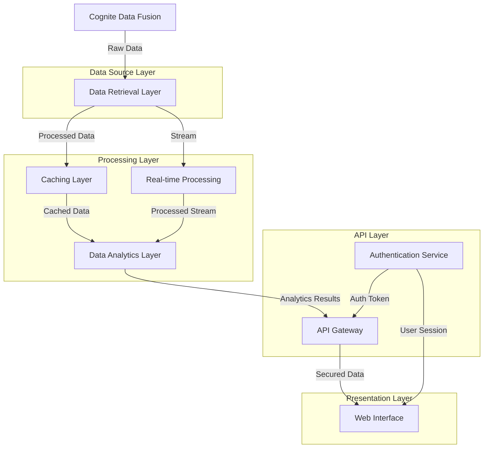

# CNTXT - Hands-on Assessment (SA)

This repository contains the code for the CNTXT - Hands-on Assessment (SA). also the readme contains the setup instructions and the overview of the architecture of the solution.

## Overview

The solution is a Python application that interacts with Cognite Data Fusion (CDF) to perform data analytics. It encompasses both real-time and batch processing capabilities, allowing for comprehensive analysis of CDF data.

Key features include:
- Data retrieval from CDF using the Cognite SDK
- Real-time analytics for immediate insights
- Batch processing for large-scale data analysis
- Flexible architecture to accommodate various analytical needs

## Architecture



### Overview of the layers

- **Data Source Layer**: This layer consists of the Data Retrieval Layer. The Data Retrieval Layer is responsible for retrieving data from CDF.
- **Processing Layer**: This layer consists of the Caching Layer, the Real-time Processing, and the Data Analytics Layer. The Caching Layer is responsible for caching data for faster access. The Real-time Processing is responsible for processing data in real-time. The Data Analytics Layer is responsible for performing analytics on the data.
- **API Layer**: This layer consists of the API Gateway and the Authentication Service. The API Gateway is responsible for routing requests to the appropriate services and handling security. The Authentication Service is responsible for authenticating users and generating tokens.
- **Presentation Layer**: This layer consists of the Web Interface and the API. The Web Interface is responsible for displaying the data to the user. The API is responsible for providing data to the client.
    - **API**: The API is responsible for providing data to the client.
    - **WEB**: The Web Interface is responsible for displaying the data to the user.

## Setup

Follow the steps below to set up the project:

```bash
# Create a virtual environment
python -m venv .venv

# Activate the virtual environment
source .venv/bin/activate

# Install the dependencies
pip install -r requirements.txt

# Run the application
python main.py

```
